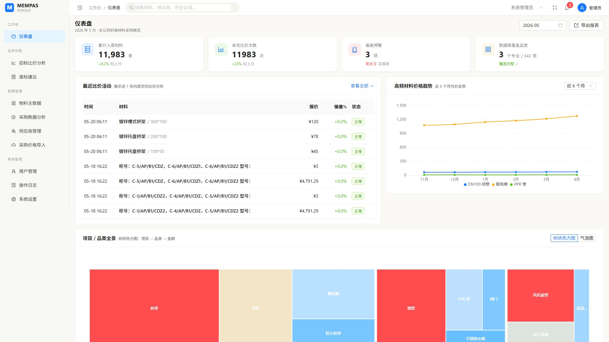
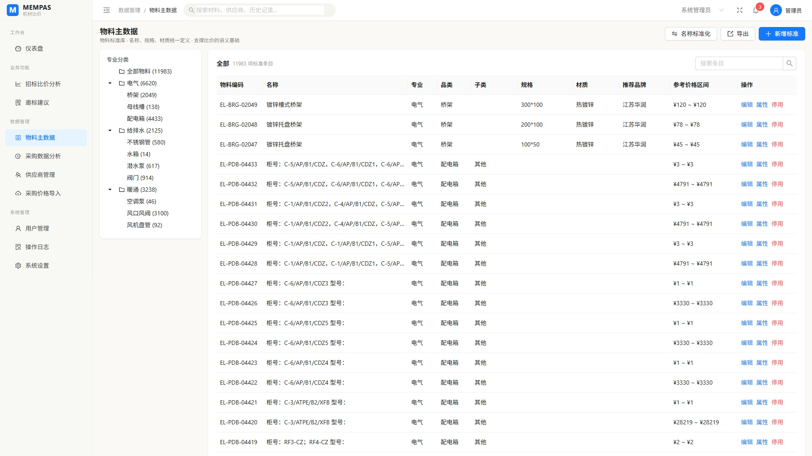
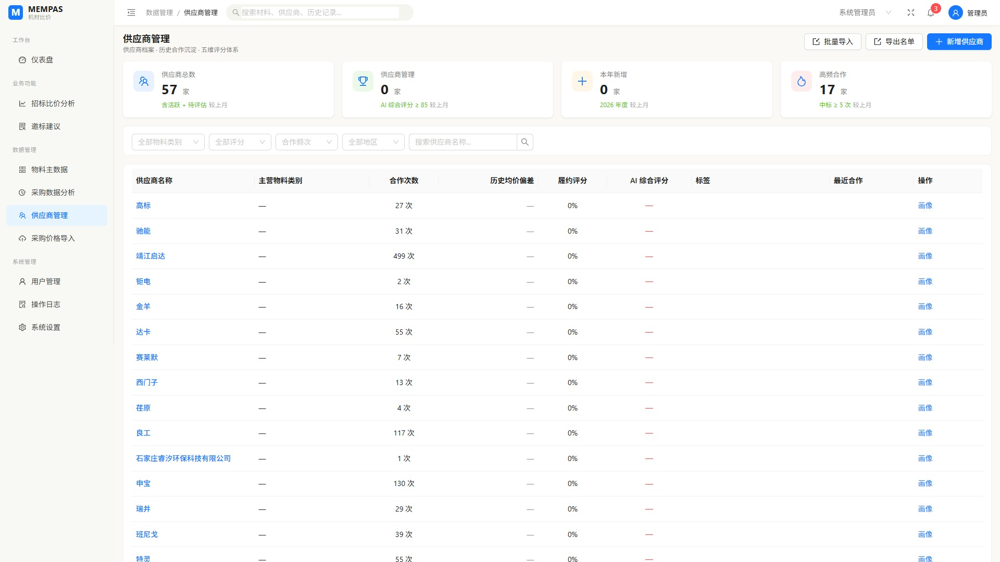
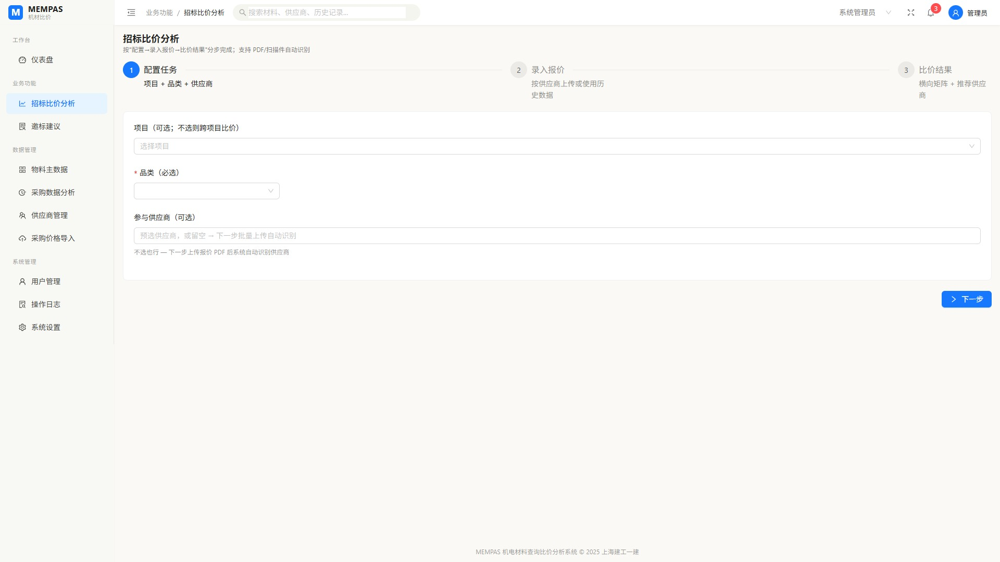
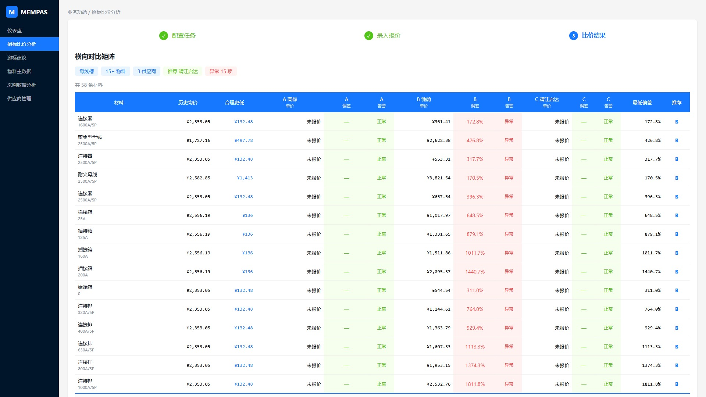
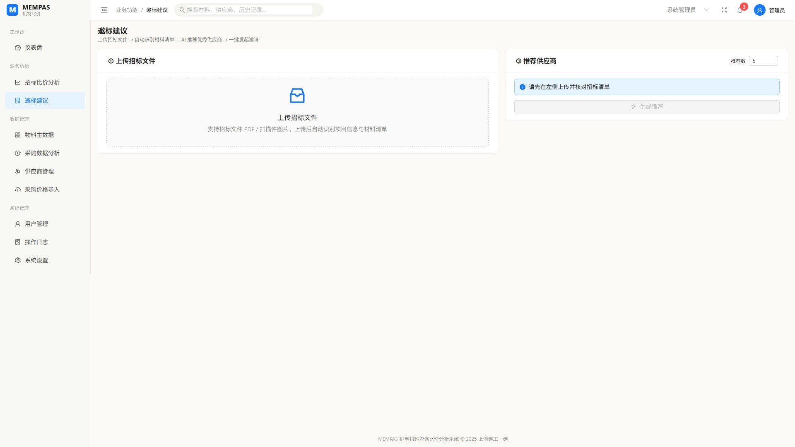
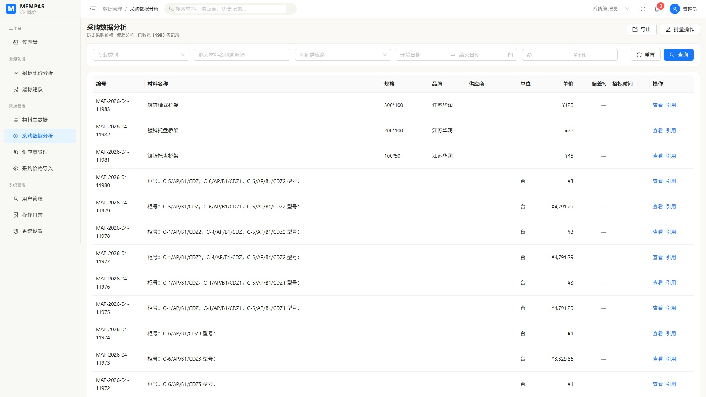
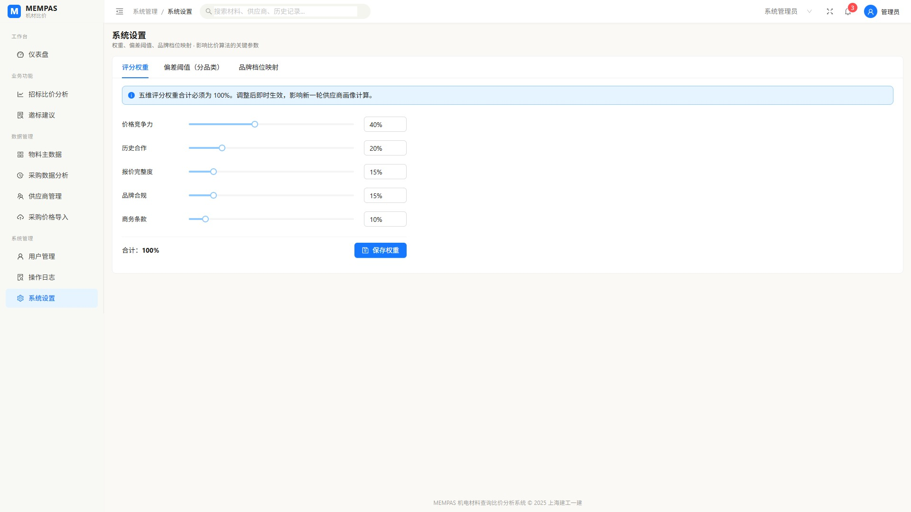
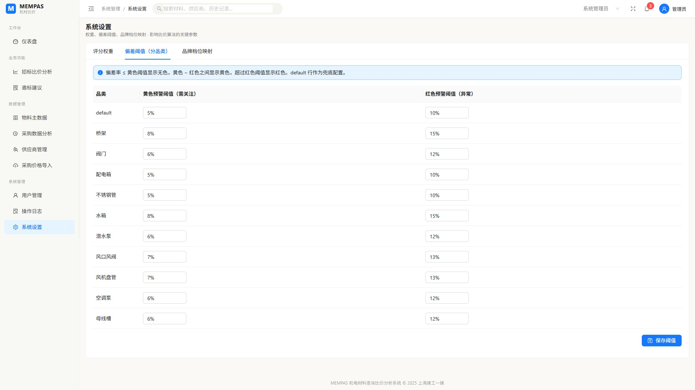

# MEMPAS 机电材料查询比价分析系统 — 功能演示

> **版本** v1.0 | **日期** 2026-05-22 | **适用场景** 客户演示 / 产品介绍

---

## 系统概述

MEMPAS（Mechanical & Electrical Material Procurement Analysis System）是面向建工集团机电采购场景的智能比价分析平台。系统覆盖 **物料标准化 → 供应商管理 → 智能邀标 → 横向比价 → 历史追溯** 全链条，通过 AI 抽取 + 多维权重评分，将传统 Excel 比价的效率提升一个量级。

### 核心数据规模

| 指标 | 数值 |
|------|------|
| 物料标准库 | 11,983 条 |
| 供应商档案 | 57 家 |
| 历史报价数据 | 11,983 条 |
| 覆盖专业 | 电气 / 给排水 / 暖通 3 大专业 |
| 覆盖品类 | 桥架、母线槽、配电箱、阀门、钢管等 10+ 品类 |

---

## 1. 系统入口


- 系统名称 **MEMPAS** + 副标题"机电材料查询比价分析系统"
- 账号 / 密码登录，支持"记住密码"
- 底部版权标识：上海建工一建

---

## 2. 仪表盘 — 全局概览

> 路径：工作台 / 仪表盘



### 四大核心指标卡

| 卡片 | 说明 |
|------|------|
| 累计入库材料 **11,983** 条 | 标准化物料总量 |
| 本月比价次数 **11,983** 次 | 当月比价活跃度 |
| 偏差预警 **3** 项 | 需关注的异常报价 |
| 数据库覆盖品类 **3** 专业 / **342** 类 | 数据完整度 |

### 最近比价活动 & 价格趋势

- 左侧表格展示近 7 天提交的比价记录，含物料名称、报价、偏差百分比、状态标签（正常 / 异常 / 需关注）
- 右侧折线图追踪高频材料（DN100 钢管、配电箱、PPR 管）近 6 个月均价走势

### 项目/品类全景 — 树状热力图


- 矩形面积 = 品类数据量，颜色区分专业
- 一眼看出：**桥架** 和 **配电箱** 是数据最厚的品类
- 支持切换"气泡图"视图
- 底部 4 个快捷入口：新建比价分析 / 上传扫描图件 / 查询历史数据 / 维护标准库

---

## 3. 物料主数据 — 标准化底座

> 路径：数据管理 / 物料主数据



### 左侧：专业分类树

```
全部物料 (11983)
├── 电气 (6620)
│   ├── 桥架 (2049)
│   ├── 母线槽 (138)
│   └── 配电箱 (4433)
├── 给排水 (2125)
│   ├── 不锈钢管 (580)
│   ├── 水箱 (14)
│   ├── 潜水泵 (617)
│   └── 阀门 (914)
└── 暖通 (3238)
    ├── 空调泵 (46)
    ├── 风口风阀 (3100)
    └── 风机盘管 (92)
```

### 右侧：物料明细表

每条物料记录包含：
- **物料编码**（如 EL-BRG-02049）
- **标准名称**（如"镀锌槽式桥架"）
- **专业 / 品类 / 子类** 三级分类
- **规格**（如 300*100）
- **材质**（如 热镀锌）
- **推荐品牌**（如 江苏华润）
- **参考价格区间**（如 ¥120 ~ ¥120）

### 操作功能

- **名称标准化**：AI 辅助合并同义物料名
- **导出**：一键导出当前品类 Excel
- **新增标准**：手动录入新物料条目
- **编辑 / 属性 / 停用**：单条维护

---

## 4. 供应商管理 — 五维评分体系

> 路径：数据管理 / 供应商管理



### 概览卡片

| 卡片 | 数值 | 说明 |
|------|------|------|
| 供应商总数 | **57** 家 | 含活跃 + 待评估 |
| 供应商管理 | 0 家 | AI 综合评分 >= 85 |
| 本年新增 | 0 家 | 2026 年度 |
| 高频合作 | **17** 家 | 中标 >= 5 次 |

### 供应商列表

每家供应商展示：
- **供应商名称**（可点击查看画像）
- **主营物料类别**
- **合作次数**（如靖江启达 499 次、申宝 130 次）
- **历史均价偏差** / **履约评分** / **AI 综合评分**
- **标签**（如"高频"、"新供应商"）

### 供应商画像抽屉

点击"画像"可查看：
- AI 五维评分雷达图（价格竞争力 / 历史合作 / 报价完整度 / 品牌合规 / 商务条款）
- 历史合作时间线
- 供应品类分布

### 批量操作

- **批量导入**：Excel 模板导入供应商名单
- **导出名单**：导出全量供应商 Excel
- **新增供应商**：手动录入

---

## 5. 招标比价分析 — 核心功能

> 路径：业务功能 / 招标比价分析

### Step 1：配置任务



三步引导式工作流：**配置任务 → 录入报价 → 比价结果**

配置内容：
- **项目**（可选，不选则跨项目比价）
- **品类**（必选，如桥架、母线槽、配电箱等）
- **参与供应商**（可选多家，也可跳过让系统自动识别）

### Step 2：录入报价

供应商报价录入支持两种方式：
- **上传 PDF / 图片**：AI 自动 OCR 识别报价单内容
- **使用历史数据，跳过上传**：直接复用数据库中的历史报价

### Step 3：横向比价矩阵 (BidMatrix)



**这是系统的核心价值展示页面。**

#### 矩阵结构

| 列 | 说明 |
|----|------|
| 材料 | 物料名称 + 规格 |
| 历史均价 | 该物料所有历史报价的均值 |
| 合理史低 | 剔除异常后的历史最低价 |
| A/B/C 供应商 | 各供应商本次报价 + 偏差率 + 告警标签 |
| 最低偏差 | 最优供应商的偏差百分比 |
| 推荐 | AI 综合推荐的供应商代号 |

#### 色标告警系统

| 颜色 | 含义 | 触发条件 |
|------|------|---------|
| 绿色（正常） | 报价在合理范围内 | 偏差 <= 黄色阈值 |
| 黄色（需关注） | 报价偏高，建议核实 | 黄色阈值 < 偏差 <= 红色阈值 |
| 红色（异常） | 报价明显偏高，需审查 | 偏差 > 红色阈值 |

#### 汇总信息栏

矩阵顶部一行即可获取关键决策信息：

- **品类标签**：母线槽
- **物料数**：556 物料
- **供应商数**：3 供应商
- **推荐供应商**：靖江启达
- **最优总价**：¥4,113,882
- **异常项数**：536 项

#### 技术亮点

- **虚拟滚动**：500+ 行数据流畅滚动，DOM 节点减少 97%
- **一键导出 Excel**：带色标、带汇总行，直接发给领导审批

---

## 6. 邀标建议 — AI 智能推荐

> 路径：业务功能 / 邀标建议



### 工作流

```
上传招标文件 → 自动识别材料清单 → AI 推荐优秀供应商 → 一键发起邀请
```

### 左侧：上传招标文件

- 支持 **PDF / 扫描件图片**
- 上传后自动 **OCR + AI 抽取**：识别项目信息与材料清单
- 抽取引擎：3 级 fallback（结构化 → 表格 → 全文）

### 右侧：推荐供应商

- **推荐数**：可配置（默认 5 家）
- 推荐依据（四维评分）：
  - 历史中标记录
  - 品类匹配度
  - 价格竞争力
  - 合作信用
- 每个推荐项附带 **AI 推荐理由**
- 勾选后一键保存邀标名单

---

## 7. 采购数据分析 — 历史追溯

> 路径：数据管理 / 采购数据分析



### 多维筛选

| 筛选条件 | 说明 |
|---------|------|
| 专业类别 | 电气 / 给排水 / 暖通 |
| 关键词 | 材料名称或编码模糊搜索 |
| 供应商 | 57 家可选 |
| 日期范围 | 开始 ~ 结束日期 |
| 价格范围 | 最低 ~ 最高单价 |

### 数据表

- 共 **11,983** 条历史报价记录
- 每条包含：编号、材料名称、规格、品牌、供应商、单位、单价、偏差%、招标时间
- 支持 **导出** 筛选结果为 Excel
- 支持 **批量操作**

---

## 8. 系统设置 — 灵活可配

> 路径：系统管理 / 系统设置

### Tab 1：评分权重



五维评分权重（合计必须 = 100%）：

| 维度 | 默认权重 | 说明 |
|------|---------|------|
| 价格竞争力 | 40% | 报价与历史均价的偏差 |
| 历史合作 | 20% | 中标次数、合作年限 |
| 报价完整度 | 15% | 报价单信息的完整程度 |
| 品牌合规 | 15% | 品牌是否在一/二/三线档位中 |
| 商务条款 | 10% | 付款条件、交期等 |

权重调整后**即时生效**，影响下一轮供应商画像计算与比价推荐排序。

### Tab 2：偏差阈值（分品类）



按品类独立配置告警阈值：

| 品类 | 黄色预警（需关注） | 红色预警（异常） |
|------|-------------------|-----------------|
| 默认 | 5% | 10% |
| 桥架 | 8% | 15% |
| 阀门 | 6% | 12% |
| 配电箱 | 5% | 10% |
| 不锈钢管 | 5% | 10% |
| 水箱 | 8% | 15% |
| 潜水泵 | 6% | 12% |
| 风口风阀 | 7% | 13% |
| 风机盘管 | 7% | 13% |
| 空调泵 | 6% | 12% |
| 母线槽 | 6% | 12% |

### Tab 3：品牌档位映射

按品类维护品牌分档（一线 / 二线 / 三线），影响品牌合规维度评分。

---

## 9. 数据导出能力

系统所有核心视图均支持 **一键导出 Excel**：

| 模块 | 导出内容 | 文件示例 |
|------|---------|---------|
| 仪表盘 | 采购概览 + 品类统计（双 Sheet） | MEMPAS_仪表盘报表_20260522.xlsx |
| 供应商 | 全量供应商名单含评分 | MEMPAS_供应商名单_20260522.xlsx |
| 物料 | 物料标准库（支持按品类筛选） | MEMPAS_物料主数据_桥架_20260522.xlsx |
| 采购历史 | 历史报价含告警色标 | MEMPAS_采购数据_20260522.xlsx |
| 比价矩阵 | 横向对比 + 偏差率 + 推荐 + 汇总行 | MEMPAS_比价矩阵_母线槽_20260522.xlsx |
| 操作日志 | 审计日志记录 | MEMPAS_操作日志_20260522.xlsx |

Excel 文件特性：
- 蓝色表头 + 白色字体
- 告警色标（绿/黄/红）自动着色
- 列宽自适应
- 支持中文文件名（RFC 5987 编码）

---

## 技术架构

```
┌─────────────────────────────────────────────┐
│              前端 (Port 3000)                │
│  Vue 3 + Vite + Ant Design Vue + ECharts    │
│  虚拟滚动 (@tanstack/vue-virtual)           │
├─────────────────────────────────────────────┤
│              后端 (Port 8002)                │
│  FastAPI + SQLAlchemy + SQLite              │
│  AI 引擎: Qwen-VL (OCR) + 3级 Fallback     │
│  Excel: openpyxl                            │
├─────────────────────────────────────────────┤
│              数据层                          │
│  SQLite (11,983 物料 / 57 供应商 / 58 项目)  │
└─────────────────────────────────────────────┘
```

---

## 截图文件说明

本文档引用的截图位于 `./demo-screenshots/` 目录，文件对应关系：

| 文件名 | 页面 |
|--------|------|
| 01-login.jpg | 系统登录页 |
| 02-dashboard-top.jpg | 仪表盘上半部分（指标卡 + 表格 + 趋势图） |
| 03-dashboard-heatmap.jpg | 仪表盘下半部分（热力图 + 快捷入口） |
| 04-materials.jpg | 物料主数据（品类树 + 物料表） |
| 05-suppliers.jpg | 供应商管理（卡片 + 列表） |
| 06-compare-config.jpg | 招标比价 Step 1 配置 |
| 07-bid-matrix.jpg | 比价矩阵（核心功能） |
| 08-invite.jpg | 邀标建议（AI 推荐） |
| 09-history.jpg | 采购数据分析（历史查询） |
| 10-settings-weights.jpg | 系统设置 - 评分权重 |
| 11-settings-thresholds.jpg | 系统设置 - 偏差阈值 |
